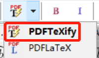
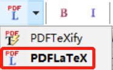
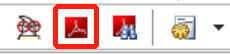

# zju_thesis_latex

## 0.包含内容

浙大研究生开题报告模板：propose文件夹

浙大研究生毕业论文模板：thesis文件夹

浙大研究生毕业论文模板：thesis_v2文件夹

## 1.使用准备

Windows下安装CTeX_2.9.2.164_Full

安装包下载地址：http://www.ctex.org/CTeXDownload/

## 2.latex模板使用

### 2.1propose和thesis的简易操作步骤

1. 打开开题报告或毕业论文的tex文件（开题报告：propose/mypropose.tex，毕业论文：thesis/mythesis.tex）
2. 按顺序点击L，B，I，L，L，dvipdf即可，如下图
   
   详细说明与使用方法详见《论文LaTeX版本快速指南V2.2.1》

### 2.2thesis_v2的简易操作步骤

1. 打开毕业论文的tex文件（thesis_v2/thesis_v2.tex）
2. 点击PDFTeXify即可，如下图
   
3. 此时，生成的pdf书签可能为乱码，可点击PDFLaTeX再生成一次，如下图
   
4. 点击PDFP review进行查看，点击弹窗中的内容可进行跳转。如下图
   